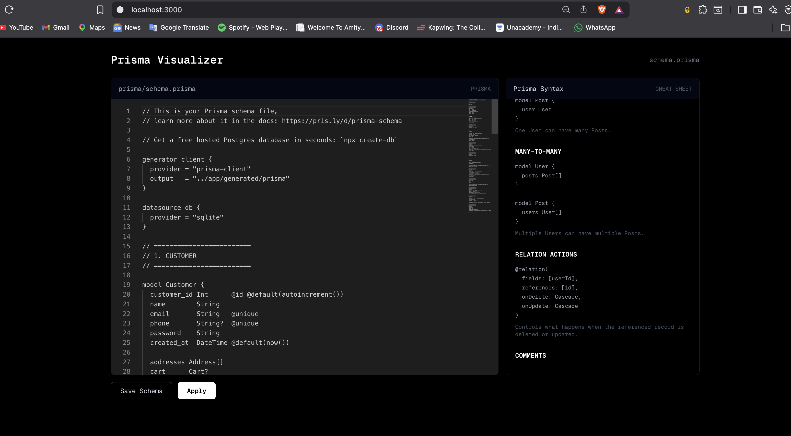
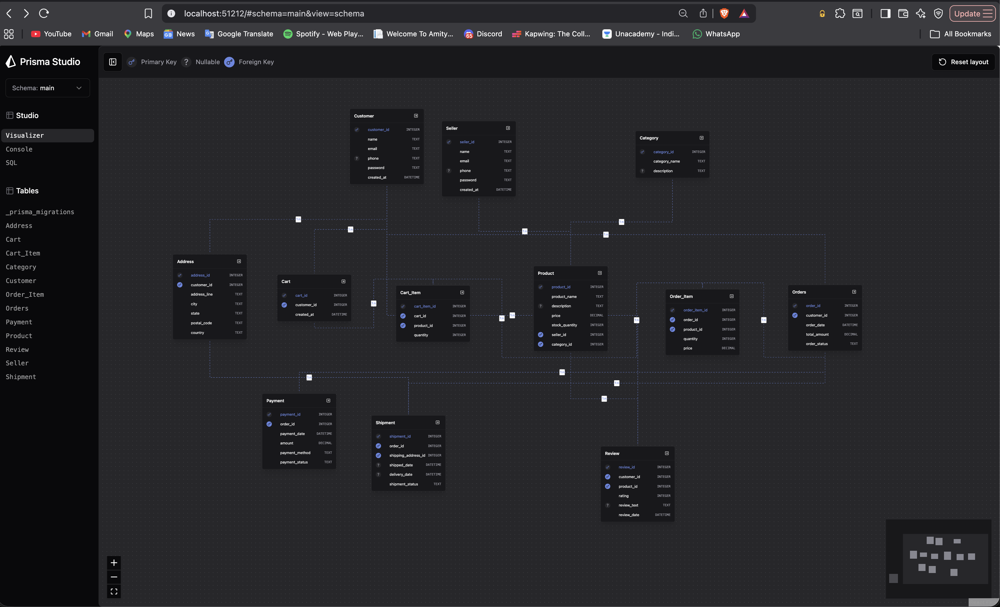

# SQLite Schema Visualiser


**Schema Visualizer** is a Next.js-based tool that lets users create and edit Prisma database schemas directly from the browser.
It features a **live terminal interface** that displays schema operations in real time and an interactive **ER diagram** for visualizing database relationships.
Built with **Next.js, TypeScript, Prisma, and SQLite**, it provides a streamlined way to design, modify, and understand database schemas.

Project Screenshots:

<p align="center">
  
</p>

<p align="center">
  
</p>

Clone and run the front-end through nextJS:

```bash
# Clone the repository
git clone https://github.com/laksh-ahuja06/Schema-Visualizer.git

# Enter the project
cd Schema-Visualizer

# Install dependencies
npm install
npm install prisma @prisma/client @prisma/adapter-better-sqlite3 dotenv @auth/prisma-adapter
npm install -D @types/better-sqlite3
npx prisma init --datasource-provider sqlite --output ../generated/prisma
npx prisma migrate dev --name init
npx prisma generate
```

### Start the Next.js development server
```bash
npm run dev
```

Then open <b>http://localhost:3000</b>

Open a second terminal while the Next.js server is running:

```bash
cd Schema-Visualizer
npx prisma studio
```

Prisma commands to run or be aware about: 

```bash
npm install prisma @prisma/client @prisma/adapter-better-sqlite3 dotenv @auth/prisma-adapter
npm install -D @types/better-sqlite3
npx prisma init --datasource-provider sqlite --output ../generated/prisma

create DB structure : npx prisma migrate dev --name init

Generate prisma client: npx prisma generate

Prisma Studio: npx prisma studio --url="file:///(File directory)/password-manager/dev.db"
```


